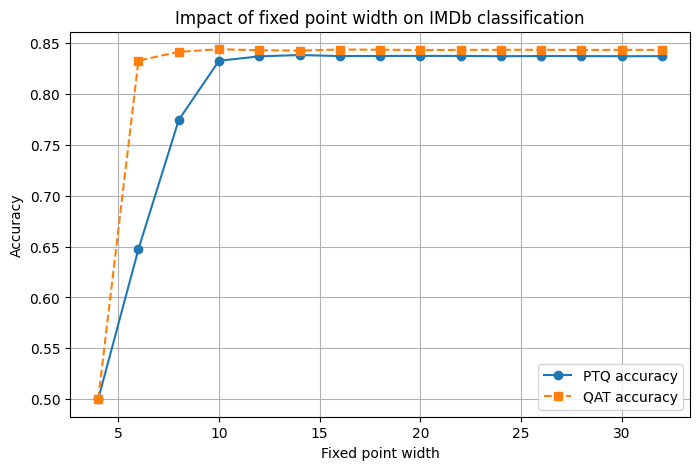
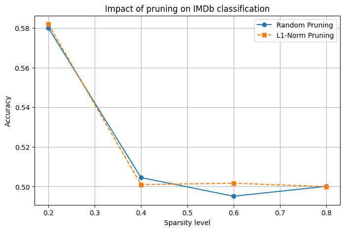
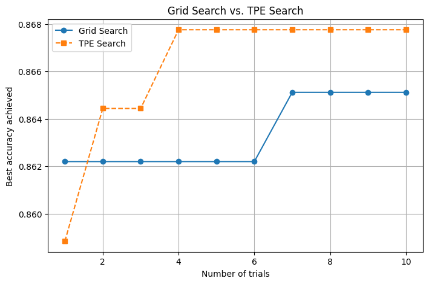
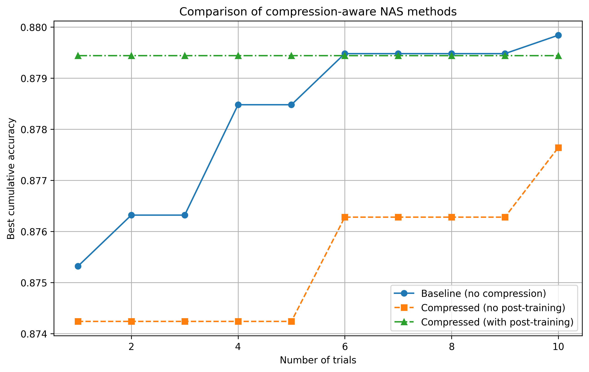
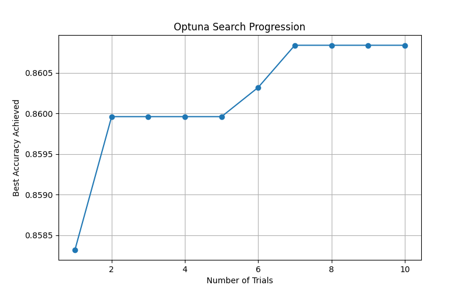
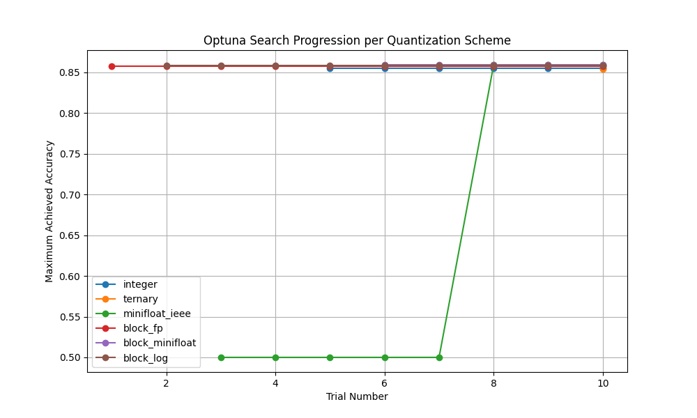

# Practical submission
- Lab & tutorials written by [Aaron Zhaa](https://aaron-zhao123.github.io/) and [Pedro Gimenes](https://www.pedrogimenes.co.uk/)
- Implementation task answer written by [Gwendal Casta (gc1724)](mailto:gwendal.casta24@imperial.ac.uk)
  
## Lab 1 - Model Compression (Quantization and Pruning)

### Task 1 - Quantization experiment
I modified every Linear layer in the model so that it supports quantization. I then explored fixed point widths from 4 to 32 bits. For each precision level, I applied both Post-Training Quantization (PTQ) and Quantization-Aware Training (QAT). After fine-tuning the model, I measured its accuracy on the IMDb dataset and recorded the highest value for each bitwidth. I plotted the fixed point width on the x-axis and accuracy on the y-axis, using separate curves for PTQ and QAT.

*Figure 1: Quantization impact*

From the graph, both PTQ and QAT show a large jump in performance at lower bitwidths, with QAT clearly performing better in that range. However, they converge starting around 12 bits, which suggests that the extra overhead of retraining for QAT may not be strictly necessary beyond this point in my opinion.

### Task 2 - Pruning experiment
For the pruning experiment, I took the best model from Task 1 and applied a pruning procedure with sparsity levels ranging from 0.2 to 0.8. I used two strategies: random pruning and L1-norm based pruning. After pruning, I fine-tuned the model and measured its accuracy on the IMDb dataset for each sparsity level. I plotted sparsity on the x-axis and accuracy on the y-axis.

*Figure 2: Pruning impact*

I noticed that increasing sparsity usually reduces accuracy. However, the L1-norm method tends a bit to keep more important parameters compared to random pruning, resulting  in slightly better performance at higher density levels (0.6 and 0.8) but the difference is minor.

### Conclusion
These experiments helped me understand the trade-offs of quantization and pruning. Both methods aim to reduce model size and computational cost. Yet, careful using techniques like QAT or the L1-norm pruning strategy is essential to minimize the loss of accuracy.

## Lab 2 - Neural Architecture Search

### Task 1 - Hyperparameter search
I used Mase to run a neural architecture search on a BERT model, focusing on hyperparameter optimization with Optuna. I tested both the GridSampler and the TPESampler, recording the highest accuracy reached at each trial.

*Figure 3: Hyperparameter search*

The results showed that the TPE approach converged to a high accuracy more quickly, while GridSampler systematically covered the search space but required more trials to match a similar performance level. This suggests that TPE’s adaptive sampling strategy can be more efficient for finding strong configurations under time constraints.

### Task 2 - Compression-aware search
I made the search compression-aware by including quantization and pruning in each trial. After partially training the model, I applied the compression pipeline and, in one setup, continued training to recover any lost accuracy. I plotted three curves: the best performance from Task 1 (no compression), compression without extra post-compression training and compression with additional training after compression.

*Figure 4: Compression-aware search*

From the figure, the model that is compressed but not retrained shows a drop in accuracy, while the model with post-compression training recovers and can match (or even slightly exceed) the baseline. These findings suggest that incorporating compression into the NAS process is beneficial, and that extra training post-compression is key to maintaining high accuracy.

## Lab 3 - Mixed Precision Search
### Task 1 - Mixed precision quantization search
I modified the original code to allow each layer to choose its own width and fractional width rather than using the same values for all layers. I set the possible widths to 8, 16, or 32 and the fractional widths to 2, 4, or 8, exposing these choices as additional hyperparameters in the Optuna search. I then ran the search and plotted a graph with the number of trials on the x-axis and the maximum achieved accuracy up to that point on the y-axis.

*Figure 5: Mixed precision quantization search*

The graph shows that as more trials are run, the model finds better configurations that improve accuracy. My observation is that allowing each layer to have its own precision setting helps the search adapt to each layer's needs, which leads to a better quantization scheme.

### Task 2 - Extended precision exploration
For Task 2, I further extended the search space to include all supported precisions for the Linear layer in Mase, such as Minifloat, BlockFP, BlockLog, and Binary, in addition to the default Integer quantization and full precision nn.Linear. This required updating the model constructor to pass the appropriate arguments for each layer type. I executed the search again and generated a figure plotting the number of trials versus the maximum achieved accuracy, with separate curves for each precision type.

*Figure 6: Extended precision exploration*

The results show some differences among the various precision methods. Apart from Minifloat having lower accuracy in a few trials, it was hard to analyze the graph in detail because many of the curves are very close together. In my view, having more precision options might improve performance, but further evaluation is needed to find the best balance between efficiency and accuracy.

## Lab 4 (Software Stream) - Performance Engineering
### Task 1 - Investigating `torch.compile`
I modified the code to measure the model’s running time both with and without a warm-up phase. This helped show that the initial compilation overhead of `torch.compile` can hide its benefits if you only run a few iterations. On the CPU, without warm-up the compiled model can be slower, but with a warm-up the overhead is amortized and a clear speedup is seen. On the GPU, a similar pattern appears: for small, fast models like Resnet18, the baseline is already very quick, so `torch.compile` does not offer a speedup. However, for a heavier model like Resnet50 and with proper warm-up, `torch.compile` gives a measurable improvement. Overall, the key is that `torch.compile`'s benefits become clear only when its compilation cost is spread over many iterations, especially for more complex models.

### Task 2 - Profiling fused SDPA kernel
I extended the profiling to compare the fused SDPA kernel against the naive implementation. On the CPU, the fused kernel ran faster than the naive version, showing a significant improvement. On the GPU, the fused version also outperformed the naive one, though the speedup was slightly less pronounced. Overall, these results confirm that kernel fusion effectively reduces runtime, but the exact benefits depend on the device, with the cpu showing a bit more improvement compared to the gpu. 

### Task 3 - Custom kernel questions

3.a. **How does MXINT8 benefit custom hardware if both the activation and weights in a linear layer are quantized to MXINT8?**

MXINT8 benefits custom hardware when both weights and activations are quantized to MXINT8 because it allows the entire computation to remain in low-precision integer format. Since there is no need to dequantize between operations, the hardware can directly perform integer arithmetic, which saves computing power and reduces memory bandwidth. Moreover, the outputs remain small, leading to lower processing memory requirements and overall more efficient computation.

3.b. **What is the purpose of the variable `dont_need_abs` and `bias` in the C++ for loop?**
   
In the loop, we extract the sign, exponent, and fraction from the quantized value. We compute the absolute value (`mantissa_abs`) and form the fraction using the lower 6 bits shifted left. The flag `dont_need_abs` checks if the 7th bit (mask `0x40`) of `mantissa_abs` is set, meaning no extra adjustment is needed.

The `bias` is built from the same sign and exponent but with a zero fraction. It represents the minimum value to subtract when the 7th bit is not set. Therefore, the final dequantized output is:
- `y[i] = out` if `dont_need_abs` is true,  
- `y[i] = out - bias` if `dont_need_abs` is false.

This adjustment ensures accurate dequantization to BFloat16.

3.c. **How does `cta_tiler` partition data for copying to shared memory in CUDA kernel? How does `layout_sX` partition threads in a threadlock for computation? (Challenge)**
   
For `cta_tiler`, the function divides the data into tiles that exactly fill one thread block. It does this by choosing the tile dimensions so that the total number of elements (m × k) does not exceed the number of threads in the block. In practice, m is chosen as the largest power of 2 that fits within the block’s available group size, ensuring that all tensors in a group are placed together while separating different groups into distinct tiles.

For `layout_sX`, threads are arranged in a two-dimensional grid that directly mirrors the tile's structure. One axis corresponds to the different groups within the block, while the other assigns threads to specific elements within each group. This organization ensures that each thread processes a distinct portion of the tile because it prevents overlapping work, leading to efficient parallel computation.

3.d. **Why the saved GPU memory is not exactly *(32 - (4+8/32))/32 = 86.7%* of the FP32 model??**

It seems to be a typo in the original calculation. The theoretical GPU memory gain should be calculated as $(32 - (8+8/32))/32$, which comes to about 74.2%. However, in practice, the memory saved is lower. This is because the formula only considers the weight storage and ignores extra overheads like memory alignment, padding, and the storage needed for quantization parameters (such as scale and zero-point). These additional factors reduce the actual memory savings compared to the ideal 74.2%.
